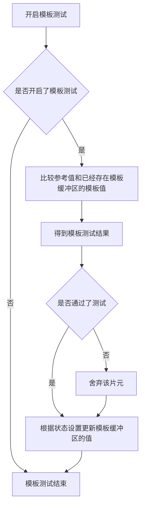
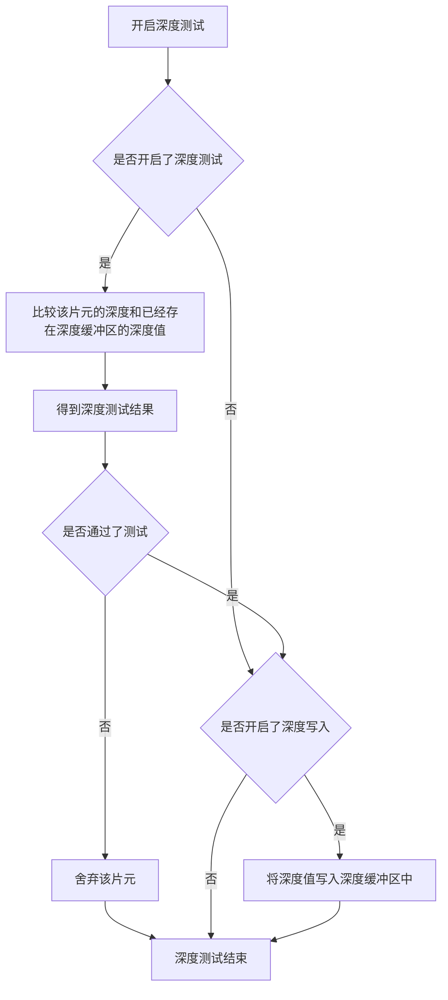
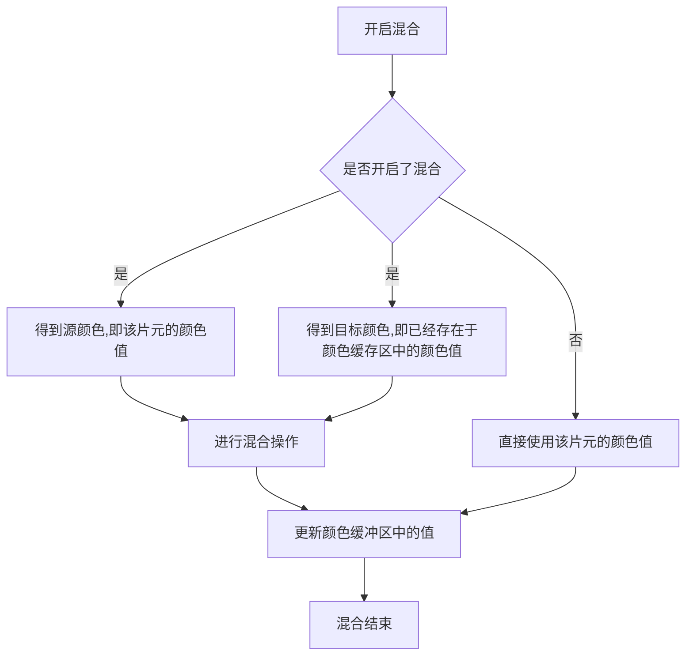

[TOC]


# Unity-shader学习笔记（一）

## 1 顶点着色器（Vertex Shader）

实现的是用一种通用的编程方式去操作顶点。一般在shader中都会将顶点着色器的参数封装为一个结构体，

```c#
struct appdata_t{
    ......
    UNITY_VERTEX_INPUT_INSTANCE_ID
}
```

结构体中的属性都是MeshRenderer（网格渲染器）在每次DrawCall的时候传递过来，我们在结构体中需要用到什么属性，就在结构体中定义什么属性，一般包含一下属性：

```c#
float4 vertex:POSITION//顶点位置
float3 normal:NORMAL//顶点法线方向
float4 texcoord:TEXCOORD0//第一纹理坐标
float4 texcoord1:TEXCOORD1//第二纹理坐标
float4 tangent:TANFENT//切线向量
float4 color：COLOR0//每个顶点(per-vertex)颜色
```

在Unity3D的UnityCG.cginc中，有几种常见的定点结构体定义

```c#
appdata_base{//包含顶点位置，法线和一个纹理坐标。
    float4 vertex:POSITION;//顶点位置
    float3 normal:NORMAL;//顶点法线方向
    float4 texcoord:TEXCOORD;//纹理坐标
    UNITY_VERTEX_INPUT_INSTANCE_ID//为顶点实例化一个ID
};
appdata_tan{//包含顶点位置，切线，法线和一个纹理坐标。
    float4 vertex:POSITION;//顶点位置
    float3 normal:NORMAL;//顶点法线方向
    float4 texcoord:TEXCOORD;//纹理坐标
    float4 tangent:TANGENT;//切线
    UNITY_VERTEX_INPUT_INSTANCE_ID//为顶点实例化一个ID
};
appdata_full{//包含位置、法线、切线、顶点色和两个纹理坐标。
    float4 vertex:POSITION;//顶点位置
    float4 tangent:TANGENT;//切线
    float3 normal:NORMAL;//顶点法线方向
    float4 texcoord:TEXCOORD0;//纹理坐标
    float4 texcoord1:TEXCOORD1;//第二纹理坐标
    float4 texcoord2:TEXCOORD2;//第三纹理坐标
    float4 texcoord3:TEXCOORD3;//第四纹理坐标
    fixed4 color:COLOR0;//顶点颜色
    UNITY_VERTEX_INPUT_INSTANCE_ID//为顶点实例化一个ID
};
appdata_img{//包含位置和一个纹理坐标。
    float4 vertex:POSITION;//顶点位置
    float4 texcoord:TEXCOORD0;//纹理坐标
    UNITY_VERTEX_INPUT_INSTANCE_ID//为顶点实例化一个ID
};
```

基于上述四个已有的结构体，可以发现vertex顶点位置是都有的，所以在我们自己定义一个顶点结构体的时候，至少要有vertex顶点位置的信息。

其次，上述四种结构体都是都是用于顶点着色器的**输入**的，就可以发现，顶点着色器的输入有：**顶点位置**、**顶点切线**、**顶点法线**、**纹理坐标**。

我们在自定义了一个顶点着色器的输入参数的结构体后，我们同时也需要定义一个用于将数据输出至片元着色器的结构体，一般命名为v2f

```c#
struct v2f{
    float4 pos:SV_POSITION;//输出顶点在裁剪空间中的位置
    float4 texcoord:TEXCOORD; //输出纹理坐标
    fixed4 color:COLOR0;//输出颜色
    ......
    UNITY_VERTEX_INPUT_INSTANCE_ID//为顶点实例化一个ID
    UNITY_VERTEX_OUTPUT_STEREO//声明该顶点是否位于视线域中，来判断这个顶点是否输出到片段着色器
}
```

v2f仅仅是一个顶点的信息，最终这个顶点着色器输出的内容是由之后的函数来决定，例如下面这个完整的顶点座着色器：

```c#
struct a2v {
	float4 vertex:POSITION;
	float3 normal:NORMAL;
	float4 texcoord:TEXCOORD0;
};

struct v2f {
	float4 pos:SV_POSITION;
	float3 color:COLOR0;
};

v2f vert(a2v v) {
	v2f o;
	o.pos = UnityObjectToClipPos(v.vertex);
	o.color = v.normal*0.5 + fixed3(0.5, 0.5, 0.5);//这儿就是对顶点进行沿法线方向的插值
	return o;//返回的是一个对象
}
```

在这个顶点着色器中，我们就可以发现，输出的对象o的颜色是根据输入的对象v的法线进行插值计算处理。

在《Unity Shader入门精要》一书中讲三角形遍历时，提到了对三角形三个顶点进行插值，它这里就是对其深度进行插值处理，这里的深度就是顶点的Z值。

数据从顶点着色器输出后，进行**裁剪（Clipping）**、**屏幕映射（Screen Coordinates）**操作后传送至**三角形遍历**，在这个阶段会根据上一个阶段的计算结果对顶点所构成的几何图形进行像素检查，检查每个像素是否会被几何图形所覆盖，如果覆盖就会生成一个**片元**，同时使用顶点信息对覆盖区域的像素进行插值处理。其输出结果是每一个片元的状态合集，包括**屏幕坐标**、**深度信息**、**法线**、**纹理坐标**等，这些数据会被用于计算每个像素的**最终颜色**。

## 2 片元着色器（Fragment Shader）

还有一个名字叫做**像素着色器（Pixel Shader）**。由于前面阶段的所有操作都不会对屏幕上每个像素进行真正意义上的颜色值的处理，只会产生一系列的数据来表示这个几何图形是如何覆盖屏幕上的像素的，此时就需要片元着色器进行颜色上的处理。

根据前面的分析我们知道输入片元着色器的数据是在三角形遍历阶段对顶点信息进行插值得到的结果，输出的就是最终的像素颜色值，以RGB的向量形式给出。同时它还会对顶点着色器阶段得到的顶点的纹理坐标进行**纹理采样**。

片元着色器的最主要的缺点就是它仅可以影响单个片元。

## 3 逐片元操作（Per-Fragment Operation）

也称作**输出合并阶段（Output-Merger ）**。

这是个奇妙的阶段，正如别名中的Merger，我们要去合并，那么合并的是什么。

我们知道这几个阶段都是在GPU中进行处理的，但并不是所有的片元都能进入GPU，还需要先解决每个片元的可见性问题。所以，逐片元操作的第一步就是**决定每个片元的可见性**，在这一步会涉及很多测试工作，最常见的也是被使用最多的就是**模板测试（Stencil Test）**和**深度测试（Depth Test）**。                                                                                                                                                                                                                                                                                                                                                                                                                                                                                                                                                                                                              

### 3.1 模板测试

什么是模板测试呢？举个例子，我们都知道印刷的时候需要制版，之后才能进行印刷。同理，每次模板测试或者模板缓冲，都需要制作好特定的模板，然后套上模板在屏幕上进行绘制，具体流程如下：



如果开启了模板测试，GPU会首先读取模板缓冲区中的该片元的模板值，然后将该值与读取到的参考值进行比较，这个比较函数是由开发者自己指定；比较后不管有没有通过测试都要对缓冲区的值来修改，这个修改操作也是由开发者制定，比如：未通过就不变，通过对应位置的值就加一等等。

模板测试主要是用于渲染。一个完整的stencil语法格式如下：

```c#
stencil{
    Ref referenceValue//这是参考值，用来与模板缓冲中的值进行比较，取值范围是0~255
    ReadMask readMask//读遮罩，取值范围是0~255
    WriteMask writeMask//写入模板缓冲时进行掩码操作取值范围是0~255
    Comp comparisonFunction//定义参考值(referenceValue)与缓冲值(),默认是always
	Pass stencilOperation0//定义当模板测试通过时，就根据stencilOperation0值对模板缓冲值stencilBufferValue进行处理，默认是keep
	Fail stencilOperation1//定义当模板测试失败时，就根据stencilOperation1值对模板缓冲值stencilBufferValue进行处理，默认是keep
	ZFail stencilOperation //定义当模板测试通过而深度测试失败时，就根据stencilOperation值对模板缓冲值stencilBufferValue进行处理，默认值：keep
}
```

每个像素模板也有自己的判断依据，具体公式如下：

```c#
if(referenceValue & readMask comparisonFunction stencilBufferValue & readMask)
    通过像素
    else
        抛弃像素
```

referenceValue与stencilBufferValue和readMask与writeMask都是按位与&进行操作

Comp定义的比较函数comparisonFunction最后得到的比较结果不再是我们在C/C++中所熟悉的0/1，而是下列取值：

| **Greater**  |  **相当于">"，即当左边>右边，模板测试通过，渲染像素**  |
| :----------: | :----------------------------------------------------: |
|  **GEqual**  | **相当于">="，即当左边>=右边，模板测试通过，渲染像素** |
|   **Less**   |  **相当于"<"，即当左边<右边，模板测试通过，渲染像素**  |
|  **LEqual**  | **相当于"<"，即当左边<=右边，模板测试通过，渲染像素**  |
|  **Equal**   |  **相当于"="，即当左边=右边，模板测试通过，渲染像素**  |
| **NotEqual** | **相当于"!="，即当左边!=右边，模板测试通过，渲染像素** |
|  **Always**  |   **不管公式两边为何值，模板测试总是通过，渲染像素**   |
|  **Never**   |  **不管公式两边为何值，模板测试总是失败，像素被抛弃**  |

在上一步的模板值比较后，就要对模板缓冲区的值进行更新。Pass、Fail、ZFail就是根据不同的判断条件对缓冲区的值进行更新的操作，这些命令取值的类型及意义如下表格：

|     Keep     |        保留当前缓冲中的内容，即stencilBufferValue不变        |
| :----------: | :----------------------------------------------------------: |
|   **Zero**   |                **将stencilBufferValue变为0**                 |
| **Replace**  | **将参考值写入缓冲，即将referenceValue赋值给stencilBufferValue** |
| **IncrSat**  |      **stencilBufferValue加1，若超过上限255，不再改变**      |
| **DecrSat**  |       **stencilBufferValue减1，若超过下限0，不再改变**       |
|  **Invert**  |        **将当前模板缓冲值stencilBufferValue按位取反**        |
| **IncrWrap** | **当前的stencilBufferValue加1，若超过255，变为0，再继续+1**  |
| **DecrWrap** | **当前的stencilBufferValue减1，若超过0，变为255，再继续-1**  |

通过上述的分析，我们可以知道模板测试的主要步骤就是对referenceValue和stencilBufferValue进行特定的比较操作。模板测试通常是用于**限制渲染的区域**，以及设置**渲染阴影**、**轮廓渲染**等。

### 3.2 深度测试

在讲深度测试之前，我们先理解什么是深度。

我们先来想想一个副画，画家为了展示出物体的远近，经常会将远的物体画得较小，或者近的物体对远的物体有所遮挡，这里物体的远近就是深度，但要注意，这个远近并不是物体直接到摄像机的距离，而是从物体做到摄像机朝向的垂线的距离。

但深度值依然可以表明物体离摄像机的远近，深度值（Z值）越大，那么物体离摄像机越远。

深度测试的流程为：



首先需要的是检测是否开启了深度测试，由变量**ZTest**来决定；开启后，GPU会将该片元的深度值和已经存在深度缓冲区中的深度值进行比较，这个比较函数可以由开发者设置，通常这个函数是小于等于的关系，因为我们总想显示离摄像机最近的物体。**这里有一个与模板测试最大的不同，就是一个片元没有通过深度测试，它是没有权力去更改深度缓冲区中的值的**。如果它通过测试，与模板测试一样，开发者可以指定是否要用这个深度去覆盖原有的深度，这个需要通过**深度写入（ZWrite On/Off）**来做到。

ZTest的取值有：Greater（该片元的深度值大于深度缓冲区的深度值）/GEqual（条件变为大于等于）/Less（条件变为小于）/LEqual（条件变为小于等于）/Equal（条件变为相等）/NotEqual（条件变为不相等）/Always（永远通过，也就是物体永远看得见）/Never（永远不通过，也就是物体永远看不见）/**Off（等同于Always）**，默认值为Equal

ZWrite的取值有：On/Off

它与ZTest和G-Buffer的Z与RGBA的联系见下表：

| Zwrite  |   ZTese    | 更新G-Buffer的Z | 更新G-Buffer的RGBA |
| :-----: | :--------: | :-------------: | :----------------: |
| **On**  |  **通过**  |      **✓**      |       **✓**        |
| **On**  | **不通过** |      **✗**      |       **✗**        |
| **Off** |  **通过**  |      **✗**      |       **✓**        |
| **Off** | **不通过** |      **✗**      |       **✗**        |

### 3.3 合并

经过上述而又不仅仅是上述的测试后，一个片元就可以进行合并功能。为什么要合并呢？我们知道在渲染的时候，物体是一个接一个画在屏幕上的，在这过程中，像素的颜色信息是先被存储在一个名为颜色缓存的地方，因此，当我们执行某一次的渲染时，上一次的颜色还存在颜色缓存区中，那么此时是要覆盖掉之前的结果，还是进行其他操作？这就是合并需要解决的事。

在《Unity Shader入门精要》一书中对合并的过程有简化版的流程图



类比于模板测试，混合操作也有两个对象：目标颜色和源颜色。

相关的操作语句：

|                     Blend On/Off                     |                          开启/关闭                           |
| :--------------------------------------------------: | :----------------------------------------------------------: |
|            **Blend SrcFactor DstFactor**             | **基本的配置并启动混合，对产生的颜色乘以SrcFactor，对已存在屏幕的颜色乘以DstFactor，并且将两者混合** |
| **Blend SrcFactor DstFactor,SrcFactorA DsrcFactorA** | **大体是同第二点，但是要使用不同的要素来混和Alpha通道，也就是有了四个操作对象** |
|                   **BlendOp Add**                    |                  **将源像素和目标像素相加**                  |
|                   **BlendOp Sub**                    |                   **用源像素减去目标像素**                   |
|                  **BlendOp RevSub**                  |                   **用目标像素减去源像素**                   |
|                   **BlendOp Min**                    |            **取目标像素和源像素的较小值作为结果**            |
|                   **BlendOp Max**                    |            **取目标像素和源像素的较大值作为结果**            |

混合因子（**Blend Factors**）的列举：（以下所有属性都可作为SrcFactor或DstFactor，其中Source指的是被计算过的颜色，Destination是已经在屏幕上的颜色）

|         One          |   值为1，使用此因子来让帧缓冲区源颜色或是目标颜色完全通过   |
| :------------------: | :---------------------------------------------------------: |
|       **Zero**       |  **值为0，使用此因子来删除帧缓冲区源颜色或是目标颜色的值**  |
|     **SrcColor**     |       **使用此因子为将当前值乘以帧缓冲区源颜色的值**        |
|     **SrcAlpha**     |   **使用此因子为将当前值乘以帧缓冲区源颜色的Alpha分量值**   |
|     **DstColor**     |      **使用此因子为将当前值乘以帧缓冲区目标颜色的值**       |
|     **DstAlpha**     |  **使用此因子为将当前值乘以帧缓冲区目标颜色Alpha分量的值**  |
| **OneMinusSrcColor** |      **使用此因子为将当前值乘以(1-帧缓冲区源颜色值)**       |
| **OneMinusSrcAlpha** | **使用此因子为将当前值乘以(1-帧缓冲区源颜色Alpha分量的值)** |
| **OneMinusDstColor** |         **使用此因子为将当前值乘以(1-目标颜色值)**          |
| **OneMinusDstAlpha** |    **使用此因子为将当前值乘以(1-目标颜色Alpha分量的值)**    |

常见的混合操作语句有：

| Blend SrcAlpha OneMinusSrcAlpha |     Alpha混合      |
| :-----------------------------: | :----------------: |
|        **Blend One One**        |      **相加**      |
| **Blend One OneMinusDstColor**  | **比较柔和的相加** |
|     **Blend DstColor Zero**     |      **乘法**      |
|   **Blend DstColor SrcColor**   |    **2倍乘法**     |

## 4 CPU与GPU的并行工作

为了提高工作效率，我们并不想CPU需要等到GPU完成上一个渲染让你无才能再次发送渲染命令，我们需要让CPU与GPU能够并行工作，解决方法就是使用一个**命令缓冲区（Command Buffer）**。

命令缓冲区包含了一个命令队列，由CPU向其中添加命令，再由GPU从中读取命令，这个添加和读取的过程是相互独立的，也就是说CPU和GPU的工作是相互独立的。当CPU进行某一次渲染的时候，CPU可以向命令缓冲区中添加命令，而当GPU完成上一个渲染后就可以直接从命令缓冲区在取出一个命令并执行它。

我们所熟知的Draw Call就是其中一种命令。但即使CPU和GPU是并行工作，命令设置的不合理依然会影响渲染的的速度，举个简单的类比例子：我们从一个文件夹复制1个10M的文件到另一个文件夹，与从一个文件夹复制10000个1KB的文件到另一个文件夹，两者总量都是10M左右，但前者所耗费的时间远少于后者，原因就是每一个复制动作都需要许多额外的动作，比如：分配内存、创建各种元数据等，复制动作越多，这些额外动作所耗费的时间也就越多。渲染也是一样的，就比如Draw Call，每次调用Draw Call之前CPU都要向GPU发送很多内容，包括数据、状态和命令等，CPU完成这些之后GPU就可以开始本次渲染，由于GPU的渲染能力很强，就会导致渲染速度快于CPU提交命令的速度，Draw Call太多，CPU就会把大量时间花在提交Draw Call上，极大可能造成CPU过载。

所以常用的方法就是将很多很小的Draw Call合并成一个大的Draw Call，这就是**批处理（Batching）**。但批处理技术有一缺点，就是它更适合那些静态的物体，对于动态物体，批处理技术不是不适用，而是使用效果并不如人意，因为这些物体的不断运动，导致每一帧都要重新进行合并然后发给GPU，这对空间和时间都会造成一定的影响。

## 5 Unity Shader

### 5.1 使用Shader的常见流程

①创建一个材质

②创建一个Unity Shader，并把它赋给上一步中创建的材质

③把材质赋给要渲染的对象

④在材质面板中调整Unity Shader的属性，以得到满意的效果

### 5.2 在Unity中官方为我们提供了4种shader

| Standard Surface Shader |          产生一个包含了标准光照模型的表面着色器模板          |
| :---------------------: | :----------------------------------------------------------: |
|    **Unlit Shader**     | **产生一个不包含光照的（但包含雾效）的基本的顶点/片元着色器** |
| **Image Effect Shader** |           **为实现屏幕后处理效果提供一个基本模板**           |
|   **Compute Shader**    |        **利用GPU进行一些与常规渲染流水线无关的计算 **        |

### 5.3 Unity Shader的基本结构

```c#
Shader "ShaderName"{
    Properties{
        //属性
    }
    SubShader{
        //显卡A使用的子着色器
    }
    SubShader{
        //显卡B使用的子着色器
    }
    Fallback "VertexLit"
}
```

#### 5.3.1 命名规则

```c#
Shader "ShaderName"{}
```

这个ShaderName包含两部分：一个是开发者自己为这个shader的命名，另一个是在材质面板中出现的位置，比如：Shader "Custom/MyShader"{}，当把这个shader赋给某个材质球后，在该材质球的材质面板的下拉列表里就能通过这个命名找到它的位置：Shader->Custom->Myshader。

#### 5.3.2 Properties属性

```c#
Properties{
    Name ("display name", PropertyType) = DefaultValue
    Name ("display name", PropertyType) = DefaultValue
    ......
}
```

声明这些属性的原因是为了在材质面板中能够方便调整各种材质的属性，即作用仅仅是为了让这些属性出现在材质面板中。

name是shader中访问这个属性的名字，通常由一个下划线开始；

display name是材质面板上展示出的名字；

PropertyType是为属性指定的类型；

DefaultValue是为这个属性设置的默认值，这个展示在属性面板上；

常见的有：

|      属性类型      |         默认值的定义语法          |                   例子                   |
| :----------------: | :-------------------------------: | :--------------------------------------: |
|      **Int**       |            **number**             |         **_Int("Int",Int) = 2**          |
|     **Float**      |            **number**             |     **_Float("Float",Float) = 1.5**      |
| **Range(min,max)** |            **number**             | **_Range("Range",Range(0.0,0.5)) = 3.0** |
|     **Color**      | **(number,number,number,number)** |  **_Color("Color",Color) = (1,1,1,1)**   |
|     **Vector**     | **(number,number,number,number)** | **_Vector("Vector",Vector) = (2,3,6,1)** |
|       **2D**       |      **"defaulttexture"{}**       |          **_2D("2D",2D)=""{}**           |
|      **Cube**      |      **"defaulttexture"{}**       |     **_Cube("Cube",Cube)="white"{}**     |
|       **3D**       |      **"defaulttexture"{}**       |        **_3D("3D",3D)="black"{}**        |

例如：

```c#
Shader "Custom/ShaderLabProperties"{
    Properties{
        _Int ("Int", Int) = 2
        _Float ("Float", Float) = 1.5
        _Range ("Range", Range(0.0, 5.0)) = 3.0
        _Color ("Color", Color) = (1,1,1,1)
        _Vector ("Vector", Vector) = (2,3,6,1)
        _2D ("2D", 2D) = "" {}
        _Cube ("Cube", Cube) = "white" {}
        _3D ("3D", 3D) = "black" {}
    }
    Fallback "Diffuse"
}
```

#### 5.3.3  SubShader

每一个Unity Shader文件可以包含多个SubShader语义块，但至少要一个。当有多个SubShader语义块时，Unity会扫描所有的语义块，选择第一个能够在目标平台上运行的SubShader，如果都不能运行，就Fallback相关语句。

SubShader中的语义下：

```c#
SubShader{
    //可选的标签
    [Tags]
    
    //可选的状态
    [RenderSetup]
    
    Pass{
        
    }
    //Other Passes
}
```

每一个Pass定义了一次完整的渲染流程，但如果Pass的数目过多，往往会造成渲染的性能下降。状态和标签同样可以在Pass声明，但其中这些标签和SubShader中设置的标签是不一样的。

##### 5.3.3.1 状态设置

这个状态设置指的是一系列渲染状态的设置指令，例如前面所提及的是否开启混合、是否开启深度测试等。

常见的渲染状态设置选项有：

|  状态名称  |                           设置指令                           |                   解释                   |
| :--------: | :----------------------------------------------------------: | :--------------------------------------: |
|  **Cull**  |                  **Cull Back\|Front\|Off**                   | **设置剔除模式：剔除背面/正面/关闭剔除** |
| **ZTest**  | **ZTest Less Greater\|LEqual\|GEqual\|Equal\|NotEqual\|Always** |       **设置深度测试时使用的函数**       |
| **ZWrite** |                      **ZWrite On\|Off**                      |          **开启/关闭深度写入**           |
| **Blend**  |                **Blend SrcFactor DstFactor**                 |          **开启并设置混合模式**          |

##### 5.3.3.2 标签

SubShader的标签是一个**键值对（Key/Value Pair）**，键和值都是字符串类型，这些键值对是SubShader和渲染引擎之间的沟通桥梁，它用来告诉Unity渲染引擎如何以及何时渲染这个对象，其结构如下：

```c#
Tags {"TagName1" = “Value1” "TagName2" = "Value2"}
```

SubShader的标签块支持的标签类型如下：

|         标签类型         |                             说明                             |                   例子                   |
| :----------------------: | :----------------------------------------------------------: | :--------------------------------------: |
|        **Queue**         |        **控制渲染顺序，指定该物体属于哪一个渲染队列**        |     **Tags {"Queue"="Transparent"}**     |
|      **RenderType**      |          **对着色器分类，可以被用于着色器替换功能**          |     **Tags {"RenderType"="Opaque"}**     |
|   **DisableBatching**    |     **用于那些进行批处理出现问题的SubShader使用批处理**      |   **Tags {"DisableBatching"="True"}**    |
| **ForceNoShadowCasting** |         **控制使用该SubShader的物体是否会投射阴影**          | **Tags {"ForceNoShadowCasting"="True"}** |
|   **IgnoreProjector**    | **如果该标签设置为”True“，那么使用该SubShader的物体将不会受Projector的影响，通常用于半透明物体** |  **Tags {"IgnoreProjector" = "True"}**   |
|  **CanUseSpriteAtlas**   | **当该SubShader是用于精灵（sprites）时，将该标签设为“False”** |  **Tags {"CanUseSpriteAtlas"="False"}**  |
|     **PreviewType**      | **指明材质面板将如何预览该材质，默认情况下时材质球，是球形，可以改为“Plane“”SkyBox“等** |     **Tags {"PreviewType"="Plane"}**     |

需要注意的是上述所有标签均只能在SubShader中声明，不能在Pass块中声明。

##### 5.3.3.3 Pass语义块

Pass的语义如下：

```c#
Pass{
    [Name]
    [Tags]
    [RenderSetup.]
    //Other code
}
```

①定义该Pass的名称------Name "MyPassName"

通过这个名称，我们就可以使用ShaderLab的UsePass命令来调用其他Unity Shader中的Pass

例如：UsePass ”MyShader/MYPASSNAME“

”“中的内容/前时Shader的名字，/后时Pass的名字，Unity内部会将所有Pass的名称转换成大写字母

②Pass中的Tags标签

用于告诉渲染引擎怎样来渲染该物体，其类型有：

|      标签类型      |                             说明                             |                     例子                     |
| :----------------: | :----------------------------------------------------------: | :------------------------------------------: |
|   **LightMode**    |          **定义该Pass在Unity的渲染流水线中的角色**           |     **Tags {"LightMode"="ForwardBase"}**     |
| **RequireOptions** | **用于指定当满足某些条件时才渲染该Pass，它的值由空格分隔的字符串** | **Tags {"RequireOptions"="SoftVegetation"}** |

### 5.4 Unity Shader的形式

我们前面提到过三种着色器：表面着色器、顶点着色器、片元着色器。

在Shader中，表面着色器被定义在SubShader语义块的CGPROGRAM和ENDCG之间；

顶点/片元着色器被定义在SubShader的Pass语义块的CGPROGRAM和ENDCG之间。

如何选择Unity Shader的形式？
①和各种光源打交道，选择表面着色器，但要注意其在移动平台的表现；

②光照数目非常少或者有很多自定义的渲染效果，选择顶点/片元着色器。

## 6 Shader的数学基础

由于笛卡尔坐标系有左手系和右手系之分，这就导致在计算机图形学中也有这两个方向的接口，OpenGL采用的左手坐标系，DirectX采用的右手坐标系。我们在Unity中所使用的是**左手坐标系**。在模型空间中，一个物体的右侧（right）、上侧（up）、前侧（forward）分别对应x轴、y轴、z轴的正方向。但对于**观察空间而言却又是右手坐标系**，观察空间也就是咦摄像机为原点的坐标系，在这个坐标系中，摄像机的前向是z轴负方向，也就是说**z值的减少意味着场景深度的增加**。

从这里就可以看出，模型空间和观察/世界空间中的定义是相反的。

### 6.1 齐次坐标

在U3D中我们不考虑高位的齐次坐标系，只考虑四维齐次坐标系。如何将原本的笛卡尔坐标系转换成齐次坐标系

对于一个点，就是将w分量设为1；

对于方向矢量，就是将w分量设为0。

#### 6.1.1 平移矩阵

我们如何将一点(x,y,z)在空间中平移(tx,ty,tz)单位？或许会说直接相加就得到结果(x+tx,y+ty,z+tz)。在笛卡尔坐标系下这个的确没错，那齐次坐标系下怎么做到一般解呢？如下：
$$
\left[\matrix
{1 & 0 & 0 & tx\\
0 & 1 & 0 & ty\\
0 & 0 & 1 & tz\\
0 & 0 & 0 & 1\\}\right]\left[\matrix
{x\\
y\\
z\\
1\\}\right]=
\left[\matrix
{x+t_x\\
y+t_y\\
z+t_z\\
1\\}\right]
$$
单纯的平移变换就是用一个左上角为单位矩阵的4x4矩阵去进行平移变换，这个4x4矩阵我们就称为平移矩阵，

其中
$$
\left[\matrix
{t_x\\
t_y\\
t_z\\
1\\}\right]
$$
这个4x1的向量为平移的方向矢量；
$$
\left[\matrix
{1 & 0 & 0\\
0 & 1 & 0\\
0 & 0 & 1\\}\right]或者
\left[\matrix
{a & b & c\\
d & e & f\\
g & h & i\\}\right]
$$
这个3x3的矩阵用于表示旋转或缩放；

所以如何构建一个平移矩阵：

左上角的3x3矩阵为单位矩阵I3，t(3x1)或者t(4x1)为平移矢量。

最后要注意的是，平移矩阵并不是一个正交矩阵。

#### 6.1.2 缩放矩阵

同平移矩阵一样：
$$
\left[\matrix
{a & 0 & 0 & 0\\
0 & b & 0 & 0\\
0 & 0 & c & 0\\
0 & 0 & 0 & 0\\}\right]\left[\matrix
{x\\
y\\
z\\
1\\}\right]=
\left[\matrix
{ax\\
by\\
cz\\
0\\}\right]
$$
当a=b=c时，我们称之为**统一缩放（Uniform Scale）**，否则称为**非统一缩放（Nonubiform Scale）**。统一缩放是扩大整个模型，但它不会改变角度和比例信息；非统一缩放就会拉伸或挤压模型，进而也就会改变角度以及比例信息。

#### 6.1.3 旋转矩阵

旋转就要有旋转轴，最简单的就是绕三个坐标轴变换，总结下来就是”绕谁谁不变“。

绕x轴：
$$
\left[\matrix{
1 & 0 & 0 & 0\\
0 & cos\theta & -sin\theta & 0\\
0 & sin\theta & cos\theta & 0\\
0 & 0 & 0 & 1\\}\right]
$$
绕y轴：
$$
\left[\matrix{cos\theta & 0 & sin\theta & 0\\0 & 1 & 0 & 0\\-sin\theta & 0 & cos\theta & 0\\0 & 0 & 0 & 1\\}\right]
$$
绕z轴：
$$
\left[\matrix{
cos\theta & -sin\theta & 0 & 0\\
sin\theta & cos\theta & 0 & 0\\
0 & 0 & 1 & 0\\
0 & 0 & 0 & 1\\
}\right]
$$

#### 6.1.4 复合变换

就是将平移、缩放、旋转组合起来的、复杂的变换。

在U3D的Shader写法中，模型的坐标变换一般是按照先缩放、再旋转，最后平移。对于其中的旋转，当给定的旋转角是(θx,θy,θz)，在U3D中规定的是zxy，即：
$$
M_{rotatθ_{Z}}M_{rotatθ_{X}}M_{rotatθ_{Y}} =\left[\matrix{
cos\theta & -sin\theta & 0 & 0\\
sin\theta & cos\theta & 0 & 0\\
0 & 0 & 1 & 0\\
0 & 0 & 0 & 1\\
}\right]\left[\matrix{
1 & 0 & 0 & 0\\
0 & cos\theta & -sin\theta & 0\\
0 & sin\theta & cos\theta & 0\\
0 & 0 & 0 & 1\\}\right]\left[\matrix{cos\theta & 0 & sin\theta & 0\\0 & 1 & 0 & 0\\-sin\theta & 0 & cos\theta & 0\\0 & 0 & 0 & 1\\}\right]
$$

### 6.2 坐标空间的变换

现实空间中我们常常要说”距哪儿xx米“，每当我们这么说的时候实际上就是在进行坐标空间的变换。在U3D中也是一样，我们要去定义一个坐标空间，必须指明其原点位置和3个坐标轴的方向，但就会发现这些数值也是相对于另一个坐标空间而言的。换句话说，每个空间都有一个**父**空间，对坐标空间的变换实际上就是在**父**空间和**子**空间之间对点和矢量进行变换。

如何求这个变换矩阵？我们以从子坐标空间到父坐标空间的变换矩阵为例：

我们给定一个坐标空间及其一点(a,b,c)，我们怎么确定这个点呢？

从坐标原点出发：

①向x轴方向移动a个单位；

②向y轴方向移动b个单位；

③向z轴方向移动c个单位；

（实际上这个点并没有移动，只是我们这么去想象的）

通过这个步骤我们可以看出，给出子空间C在父空间P下的的三个坐标轴的表示Xc、Yc、Zc，及子空间C的原点坐标，当给出子空间的一点A(a,b,c)时，就可以求出其在父坐标空间P下的坐标。

已知子坐标空间C的原点位置Oc，C的三个坐标轴的失向量xc,yc,zc，Ac(a,b,c)，求出Ap

依然按照上面的三个步骤：

先向x轴移动：
$$
O_{c}+ax_{c}
$$
再向y轴移动：
$$
O_{c}+ax_{c}+by_{c}
$$
再向z轴移动
$$
O_{c}+ax_{c}+by_{c}+cz_{c}
$$
于是我们就得出了从子空间到父空间的变换公式：
$$
A_{p} =O_{c}+ax_{c}+by_{c}+cz_{c}
$$
有朋友会说，嗯？这只是一个表达式，跟之前变换的矩阵形式不一样？变变形就好了
$$
O_{c}+ax_{c}+by_{c}+cz_{c}\\
=(x_{oc},y_{oc},z_{oc})+a(x_{oc},y_{oc},z_{oc})+b(x_{oc},y_{oc},z_{oc})+c(x_{oc},y_{oc},z_{oc})\\
=(x_{oc},y_{oc},z_{oc})+\left[\matrix{x_{xc} & x_{yc} & x_{zc}\\y_{xc} & y_{yc} & y_{zc}\\z_{xc} & z_{yc} & z_{zc}}\right]\left[\matrix{a\\b\\c}\right]\\
=(x_{oc},y_{oc},z_{oc})+\left[\matrix{| & | & |\\X_{xc} & Y_{yc} & Z_{zc}\\| & | & |}\right]\left[\matrix{a\\b\\c}\right]\\
$$
引入齐次坐标系后，再根据平移矩阵的构建法则，有：
$$
(x_{Oc},y_{Oc},z_{Oc},1)+
\left[\matrix
{| & | & | & 0
\\X_{xc} & Y_{yc} & Z_{zc}& 0
\\| & | & | & 0\\
0 & 0 & 0 & 1
}\right]
\left[\matrix{a\\b\\c\\1}\right]\\
=\left[\matrix
{1 & 0 & 0 & x_{Oc}\\
0 & 1 & 0 & y_{Oc}\\
0 & 0 & 1 & z_{Oc}\\
0 & 0 & 0 & 1\\}\right]
+\left[\matrix
{| & | & | & 0
\\X_{xc} & Y_{yc} & Z_{zc} & 0
\\| & | & | & 0
\\0 & 0 & 0 & 1
}\right]
\left[\matrix{a\\b\\c\\1}\right]\\
=\left[\matrix
{| & | & | & x_{Oc}
\\X_{xc} & Y_{yc} & Z_{zc} & y_{Oc}
\\| & | & | & z_{Oc}
\\0 & 0 & 0 & 1
}\right]
\left[\matrix{a\\b\\c\\1}\right]\\
=\left[\matrix
{| & | & | & |
\\X_{xc} & Y_{yc} & Z_{zc} & O_{Oc}
\\| & | & | & |
\\0 & 0 & 0 & 1
}\right]\left[\matrix{a\\b\\c\\1}\right]\\
$$
于是就求得坐标空间的变换矩阵：
$$
M_{CA} =\left[\matrix
{| & | & | & |
\\X_{xc} & Y_{yc} & Z_{zc} & O_{Oc}
\\| & | & | & |
\\0 & 0 & 0 & 1
}\right]
$$
怎么理解这个变换？

从这个推导过程就可以发现，坐标空间的变换其实是把一个方向矢量从子坐标系变换到父坐标系。

那么我们就能由已知的从模型空间到世界空间的一个4*4的变换矩阵，通过对其每一列进行归一化后求得单位矢量，也就是求Mca的逆矩阵。

即：
$$
M_{AC} = M_{CA}^{-1}
$$
但学过线代的朋友知道有一种情况不用求逆矩阵，即当Mca是正交矩阵时，其逆矩阵等于它的转置，也就是说：
$$
M_{AC} = M_{CA}^{T}
$$
明显，矩阵的转置比矩阵的逆更好求解。

在Shader中，我们一般是使用左上角的3*3矩阵来对法线方向、光照方向来进行空间变换。

这里我们用一道实例来进行上述所有的说明：
$$
\begin{align}
已知：\\ &
子坐标系\alpha的三轴向量d(dx,dy,dz),u(ux,uy,uz),r(r,ry,rz)\\&
子坐标系远点p(px,py,pz)\\&
目标点a(ax,ay,az)\\
求:\\&
点a在父坐标系A当中的坐标b(bx,by,bz)\\
解:\\&
根据上述得转换矩阵：\\&
T = \left[\matrix{
rx & ux & dx & px\\
ry & uy & dy & py\\
rz & uz & dz & pz\\
0 & 0 & 0 & 1\\
}\right]\\&
a = \left[\matrix{
ax\\ay\\az\\1
}\right]\\&
就能得到：\\&
b = Ta = \left[\matrix{
rx & ux & dx & px\\
ry & uy & dy & py\\
rz & uz & dz & pz\\
0 & 0 & 0 & 1\\
}\right]*\left[\matrix{
ax\\ay\\az\\1
}\right] = \left[\matrix{
bx\\by\\bz\\1
}\right]\\
其中：\\&
\left\{ \begin{array}{rcl}
bx = ax*rx+ay*ux+az*dx+px\\
by = ax*ry+ay*uy+az*dy+py\hfill\\
bz = ax*rz+ay*uz+az*dz+pz\hfill
\end{array}\right.

\end{align}
$$
（注意矩阵乘法的左右顺序）

### 6.5模型变换

在讲模型变换前先讲讲两个空间-模型空间和世界空间

#### 6.5.1 模型空间

简单点理解，模型空间就是每个模型自己所带有的空间，也称为"对象空间""局部空间"，这个空间的原点和坐标轴一般是由美术人员在进建模软件中确定好的，导入Unity后我们可以在顶点着色器中访问到模型的顶点信息，包括了每个顶点的坐标。但要注意的是，这些顶点坐标只是相对于模型空间的原点（通常为重心）来定义的。

#### 6.5.2 世界空间

就是我们所关心的最大的空间。这里这个关心很模糊，就是说，对于某个模型，你所把它放在的另一个大的世界里的空间。

#### 6.5.3 顶点变换——从模型空间到世界空间

模型变换就是将顶点坐标从模型空间到世界空间的变换。例如：

一个模型空间下坐标为(0,2,4)的顶点，进行了(2,2,2)的缩放，(0,150,0)的旋转，(5,0,25)的平移后，变换到世界空间中，求该顶点在世界空间中的坐标。

求解过程如下：
$$
\begin{align}
P_{world} &= M_{model}*P_{model}\\
M_{model} &= M_{translation}*M_{rotation}*M_{scale}\\&
=\left[\matrix{
1 & 0 & 0 & 5\\
0 & 1 & 0 & 0\\
0 & 0 & 1 & 25\\
0 & 0 & 0 & 1\\
}\right]*\left[\matrix{
-0.866 & 0 & 0.5 & 0\\
0 & 1 & 0 & 0\\
-0.5 & 0 & -0.866 & 0\\
0 & 0 & 0 & 1\\
}\right]*\left[\matrix{
2 & 0 & 0 & 0\\
0 & 2 & 0 & 0\\
0 & 0 & 2 & 0\\
0 & 0 & 0 & 1\\
}\right]\\&
=\left[\matrix{
-1.732 & 0 & 1 & 5\\
0 & 2 & 0 & 0\\
0 & 0 & -1.732 & 25\\
-1 & 0 & 0 & 1\\
}\right]\\
那么接可以算出P_{world} &= \left[\matrix{
-1.732 & 0 & 1 & 5\\
0 & 2 & 0 & 0\\
0 & 0 & -1.732 & 25\\
-1 & 0 & 0 & 1\\
}\right]*\left[\matrix{
0\\
2\\
4\\
1\\
}\right]\\
&=\left[\matrix{
9\\
4\\
18.072\\
1\\
}\right]
\end{align}
$$
先提这里的两点注意事项：

①当说了某一种变换顺序时，就是从第一种的变换矩阵逐个左乘后面的变换矩阵；

②旋转变换时，(θx,θy,θz)的三个坐标值分别表示绕x轴旋转θ，绕y轴旋转θ，绕z轴旋转θ。

#### 6.5.4 观察空间

还有一个空间是观察空间，也称为摄像机空间。也前面两种空间不同，模型空间和世界空间都是采用的左手坐标系，而观察空间采用的是右手坐标系。

摄像机决定了我们渲染游戏所使用的视角，

#### 6.5.6 顶点变换——从世界空间到观察空间

正如我们在6.5.4中所介绍的那样，由于观察空间所使用的坐标系跟其他两个不一样，这就使得从世界空间到观察空间的变换有两种：

①计算观察空间的三个坐标轴在世界空间下的表示，然后构建出观察空间到世界空间的变换矩阵，再去求逆，就能得到世界空间到观察空间的变换矩阵。

②平移整个观察空间，使观察空间的与世界空间的原点重合（成为初始状态）。

我们一般采用的是第二种，毕竟好算点。

假设当我们点开Camera的Transform组件，显示的是Position(0,10,-10)，Rotation(30,0,0)，Scale(1,1,1)，意味着摄像机在世界空间中的变换是先按照(30,0,0)旋转，再按照(0,10,-10)平移，没有任何的缩/扩放。那么要把其移回初始状态，就要逆向变换——先按照(0,-10,10)平移，再按照(-30,0,0)旋转。所以：
$$
\begin{align}
M_{view} &= \left[\matrix{
1 & 0 & 0 & 0\\
0 & 0.866 & 0.5 & 0\\
0 & -0.5 & 0.866 & 0\\
0 & 0 & 0 & 1\\
}\right]*\left[\matrix{
1 & 0 & 0 & 0\\
0 & 1 & 0 & -10\\
0 & 0 & 1 & 10\\
0 & 0 & 0 & 1\\
}\right]\\
&=\left[\matrix{
1 & 0 & 0 & 0\\
0 & 0.866 & 0.5 & -3.66\\
0 & -0.5 & 0.866 & 13.66\\
0 & 0 & 0 & 1\\
}\right]
\end{align}
$$
由于观察坐标采用的右手坐标系，所以要对Z分量取反，最终结果为：
$$
M_{view}= \left[\matrix{
1 & 0 & 0 & 0\\
0 & 0.866 & 0.5 & -3.66\\
0 & 0.5 & -0.866 & -13.66\\
0 & 0 & 0 & 1\\
}\right]
$$
可以通过左乘一个矩阵来实现取反：
$$
M_{nsgats} = \left[\matrix{
1 & 0 & 0 & 0\\
0 & 1 & 0.5 & 0\\
0 & 0 & -1 & 0\\
0 & 0 & 0 & 0\\
}\right]
$$
用6.53中的数据进行变换后的观察空间坐标就是：
$$
\begin{align}
P_{view} &= M_{view}*P_{world}\\
&= \left[\matrix{
1 & 0 & 0 & 0\\
0 & 0.866 & 0.5 & -3.66\\
0 & 0.5 & -0.866 & -13.66\\
0 & 0 & 0 & 1\\
}\right]*\left[\matrix{
9\\
4\\
18.072\\
1
}\right]\\
&= \left[\matrix{
9\\
8.84\\
-27.31\\
1
}\right]
\end{align}
$$


#### 6.5.7 裁剪空间

还记得顶点着色器的数据输出后的下一步操作吗？是的，就是裁剪。

裁剪空间的目标就是能够方便对渲染图员进行裁剪：在这块空间内的的图元会被保留，外面部分直接裁剪掉。

这块空间怎么确定呢？视锥体

用过Unity的朋友都知道摄像机的视野其实就是一个视锥体，也就是说，视锥体的这个空间区域，也就是摄像机能够看见的空间。

视锥体由六个平面包围而成，这六个平面也称为裁剪平面，有两个特殊的裁剪平面：近裁剪平面和远裁剪平面，他们决定了摄像机能看到的深度范围。视锥体也有两种类型长方体型和金字塔型，分别决定了两种投影类型：正交投影和透视投影。（视锥体的类型选择在Camera的Projection中进行选择）

在正交投影中，所有网格大小都一样，并且平行线会一直保持平行；在透视投影中，离摄像机越近的网格越大，越远的网格越小，并且网格的先并不平行。

基于上述的区别，在3D游戏中一般采用透视投影；在2D游戏或渲染小地图等其他HUD元素一般采用正交投影。

这里我们采用通过一个矩阵将世界空间中的顶点坐标转换到一个裁剪空间中。

#### 6.5.8 顶点变换——从观察空间到裁剪空间

这个矩阵有两个目的：

①为后面的屏幕映射做准备

②对坐标的x，y，z分量做准备：使用w分量作为一个范围值，x、y、z都在这个范围内就说明该顶点位于裁剪空间内。

在之前的变换中，我们所使用的w分量都是固定的：点的w为1，方向矢量的w为0。在这里的变换中，w的意义就更加丰富了。

##### 6.5.8.1 透视投影

在Camera组件中有这样三个参数：Field of View(FOV)、Near Clippling Planes、Far Clippling Planes三个参数：

①Field of View(FOV)：用于控制视锥体的张口角度

②Near Clippling Planes、Far Clippling Planes：分别控制近裁剪平面和远裁剪平面离摄像机的远近

通过上述参数我们就能求得近裁剪平面和远裁剪平面的高度：
$$
\begin{align}
nearClipPlaneHeight &= 2*Near*tan(\frac{FOV}{2})\\
farClipPlaneHeight &= 2*Far*tan(\frac{FOV}{2})
\end{align}
$$
这里我们就得到了视锥体的纵向信息，那横向呢？通过摄像机的横纵比。

在Unity中，一个摄像机的横纵比由Game视图的横纵比和Camera组件中的Viewport Rect中的W和H值共同决定

我们先定义当前摄像机的横纵比Aspect：
$$
\begin{align}
Aspect &= \frac{nearClipPlaneWidth}{nearClipPlaneHeight}\\
Aspect &= \frac{farClipPlaneWidth}{farClipPlaneHeight}
\end{align}
$$
那么就根据已知的Near、Far、FOV、Aspect的值就能确定透视投影的变换矩阵：
$$
M_{projection-pers}=
\left[\matrix{
\frac{cot\frac{FOV}{2}}{Aspect} & 0 & 0 & 0\\
0 & cot\frac{FOV}{2} & 0 & 0\\
0 & 0 & -\frac{Far+Near}{Far-Near} & -\frac{2*Near*Far}{Far-Near}\\
0 & 0 & -1 & 0\\
}\right]
$$
（这个公式是建立在z分量的范围为[-w,w]，这是在Unity中；若在DX，z分量范围就不是这个了）

一点(x,y,z,1)由观察空间变换到裁剪空间后的点为：
$$
\begin{align}
P_{clip} &= M_{projection-pers}P_{view}\\
&=\left[\matrix{
\frac{cot\frac{FOV}{2}}{Aspect} & 0 & 0 & 0\\
0 & cot\frac{FOV}{2} & 0 & 0\\
0 & 0 & -\frac{Far+Near}{Far-Near} & -\frac{2*Near*Far}{Far-Near}\\
0 & 0 & -1 & 0\\
}\right]*
\left[\matrix{
x\\
y\\
z\\
1\\
}\right]\\
&=
\left[\matrix{
x\frac{cot\frac{FOV}{2}}{Aspect}\\
ycot\frac{FOV}{2}\\
-z\frac{Far+Near}{Far-Near}-\frac{2*Near*Far}{Far-Near}\\
-z\\
}\right]
\end{align}
$$
对这个结果你就会发现，这个透视投影的变换矩阵本质上就是对x，y，z分量的缩放，这就为了更容易地裁剪。

同时你也会发现，变换后的点的w分量不再是1，而是原z分量的取反。

接下来就该对变换后的x，y，z分量进行判断，是否在[-w,w]内。

注意：

①整个过程分为两个步骤：第一步先用裁剪空间的矩阵对顶点做线性变换变到裁剪空间，此时w从1->-z；第二步将w与范围值进行比较（就是上面的[-w,w]，等价于[NearZ,FarZ]）；

②w取为-z，这就意味着此时从观察空间的右手系坐标又回到了左手系坐标；

③整个变换就是对顶点进行了缩放，用裁剪空间来重新表达顶点的位置，尽管在世界空间中会发现这个点的坐标并没有变化。这也就是等价于用子坐标系来表示父坐标系的顶点就需要对坐标的值进行缩放。

##### 6.5.8.2 正交投影

正交投影相比于透视投影就简单多了，毕竟它的视锥体仅仅是一个长方体。

和透视投影类似，在Unity中，正交投影的六个裁剪平面也是由Camera组件中的参数和Game视图的横纵比共同决定。

通过Camera组建的Size属性可以调整整个视锥体宽高的大小，但这个size只是这个窗口的一半；Near和Far可以调整视锥体的近裁剪平面和远裁剪平面距离摄像机的远近。就可以求得近远裁剪平面的高度：
$$
nearClipPlaneHeight = farClipPlaneHeight = 2*Size
$$
横向信息也可以通过摄像机的横纵比得到：
$$
\begin{align}
Aspect &= \frac{nearClipPlaneWidth}{nearClipPlaneHeight}\\
farClipPlaneWidth &= nearClipPlaneWidth
\end{align}
$$
那么就根据已知的Near、Far、FOV、Aspect的值就能确定正交投影的变换矩阵：
$$
M_{projection-orth}=
\left[\matrix{
\frac{1}{Aspect*Size} & 0 & 0 & 0\\
0 & \frac{1}{Size} & 0 & 0\\
0 & 0 & -\frac{2}{Far-Near} & -\frac{Near*Far}{Far-Near}\\
0 & 0 & 0 & 1\\
}\right]
$$
一点(x,y,z,1)由观察空间变换到裁剪空间后的点为：
$$
\begin{align}
P_{clip} &= M_{projection-orth}P_{view} \\
&= \left[\matrix{
\frac{1}{Aspect*Size} & 0 & 0 & 0\\
0 & \frac{1}{Size} & 0 & 0\\
0 & 0 & -\frac{2}{Far-Near} & -\frac{Near*Far}{Far-Near}\\
0 & 0 & 0 & 1\\
}\right]*
\left[\matrix{
x\\
y\\
z\\
1
}\right]\\
&= \left[\matrix{
\frac{x}{Aspect*Size}\\
\frac{y}{Size}\\
-\frac{2z}{Far-Near}-\frac{Far+Near}{Far-Near}\\
1
}\right]
\end{align}
$$
此时与透视投影的区别就出现了，变换后的点的w分量依然是1，原因就在M(projection-pers)的w向量是[0 0 -1 0]，而M(projection-orth)的w分量是[0 0 0 1]。

不过最后的判断，两种变换是一样的。

##### 6.5.8.3 对6.5.6的结果进行变换

假定这是一个3D游戏的某个点，那么我们要使用的就是透视投影，其参数假定为：FOV = 60°，Near = 5， Far = 40，Aspect = 4/3 = 1.333。

那么其变换矩阵就是：
$$
\begin{align}
M_{projection-pers}&=
\left[\matrix{
\frac{cot\frac{FOV}{2}}{Aspect} & 0 & 0 & 0\\
0 & cot\frac{FOV}{2} & 0 & 0\\
0 & 0 & -\frac{Far+Near}{Far-Near} & -\frac{2*Near*Far}{Far-Near}\\
0 & 0 & -1 & 0\\
}\right]\\
&=
\left[\matrix{
1.299 & 0 & 0 & 0\\
0 & 1.732 & 0 & 0\\
0 & 0 & -1.286 & -11.429\\
0 & 0 & -1 & 0\\
}\right]
\end{align}
$$
最终的点就是：
$$
\begin{align}
P_{clip} &= M_{projection-pers}*P_{view}\\
&= \left[\matrix{
1.299 & 0 & 0 & 0\\
0 & 1.732 & 0 & 0\\
0 & 0 & -1.286 & -11.429\\
0 & 0 & -1 & 0\\
}\right]*
\left[\matrix{
9\\
8.84\\
-27.31\\
1
}\right]\\
&= \left[\matrix{
11.691\\
15.311\\
23.692\\
27.31
}\right]
\end{align}
$$
那么|w| = 27.31，将x、y、z与w进行比较-->都小于，所以这个点及所代表的模型在视锥体内，不需要裁剪。

#### 6.5.9 屏幕空间

正如其名，就是我们的屏幕，也是最终所有图像的显示地方。

在6.58中我们得到了裁剪空间下的坐标，那么怎么才能将坐标信息转换到屏幕空间下，毕竟屏幕空间只是一个2D空间，而裁剪空间是一个3D空间。

两个步骤：

①标准奇次除法：也被称为透视除法。就是用w分量去除以x，y，z分量，得到的坐标也可以称为归一化的设备坐标（NDC）。这样x，y，z分量的范围就是[-1,1]（在DX中，这个范围是[0,1]），裁剪空间就变成了一个单位立方体，实际上这一步只对透视投影有影响，毕竟正交投影的w分量为1，它的裁剪空间就是一个立方体。

②屏幕映射：经过第一步之后透视投影和正交投影的视锥体都变换到一个相同的立方体中，就可以根据此时的x，y分量来映射输出窗口的对应像素坐标。

要注意：在Unity中，屏幕空间左下角的像素坐标才是(0,0)，右上角的坐标是(pixelWidth, pixelHeight)。

整个步骤的过程可由下面的公式来总结：
$$
\begin{align}
screen_{x} &= \frac{clip_{x}*pixelWidth}{2*clip_{w}}+\frac{pixelWidth}{2}\\
screen_{y} &= \frac{clip_{y}*pixelHeight}{2*clip_{w}}+\frac{pixelHeight}{2}
\end{align}
$$
z分量呢？通常z分量会被用于深度缓冲，虽然传统做法是clip(z)/clip(w)的值直接存进深度缓冲，但现在驱动会根据硬件来选择最好的存储格式。

依然使用上一个空间的数据，假设当前屏幕的像素宽高分别为：400，300；那么最终投影在屏幕上的点的坐标就是：
$$
\begin{align}
screen_{x} &= \frac{clip_{x}*pixelWidth}{2*clip_{w}}+\frac{pixelWidth}{2}\\
&= \frac{11.691*400}{2*27.31}+\frac{400}{2}\\
&= 285.617
\\
screen_{y} &= \frac{clip_{y}*pixelHeight}{2*clip_{w}}+\frac{pixelHeight}{2}\\
&= \frac{15.311*300}{2*27.31}+\frac{300}{2}\\
&= 234.096
\end{align}
$$
屏幕上的位置就是：（286.617,234.096）。

#### 6.5.10 总结

上述九节就介绍了一个顶点是如何从模型空间最终变换到屏幕空间的渲染流水线，最主要的三个变换矩阵：模型变换矩阵、观察变换矩阵、投影变换矩阵，也被合称为MVP矩阵。

在这里面的五个空间里，只有观察空间是右手坐标系。