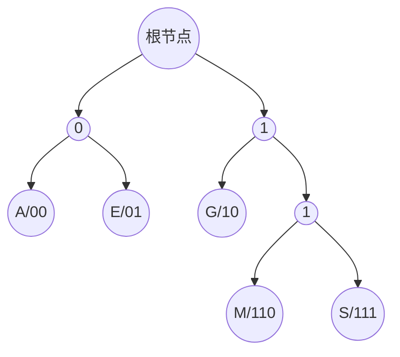

# 二叉树--(邓书学习)

在前面我们学到了向量、列表、栈、队列等线性的数据结构，但它们或多或少都有时间或者空间上的妥协，比如数组，我们可以通过下标或秩的方式以常数时间找到目标对象，并进行读取其内容，但要进行删除或者插入时，都需要耗费线性的时间；而链表虽然允许我们借助引用或位置对象，在常数时间内实现删除或者插入，但为了找到特定的目标元素，不得不花费线性的时间对整个结构进行遍历查找。

于是引入二叉树.

## 1.1二叉树及其子部分的概念

### 1.1.1 树

树的结构是非线性结构，它的元素之间并不存在天然的直接后继或直接前驱。但加上一些限制条件后（比如约束），就能够在树结构的元素之间确定某种线性次序，也可称树为半线性结构。

那什么是树呢？数由一组顶点（vertex/node）以及连接与其间的若干条边（edge）组成。

#### 1.1.1.1 深度

我们将沿每个节点v到根r的唯一通路所经过边的数目称作v的深度。

对于根节点，约定其深度depth(r) = 0，故其属于第0层。

#### 1.1.1.2 祖先（父代）、后代、子树

沿任一节点v到根结点的路径上，经过的所有节点都可以称为v的**祖先**，相邻的那个祖先称其为v的**父代**。特别的，v的祖先包括了树根以及v本身，其中除v外的其余祖先都可称之为**真祖先**；对称的讲，v的后代也包括了其本身，其余的后代都称之为**真后代**。

而子树，对于任一节点v的所有后代及其之间的连边称作**子树**。

#### 1.1.1.2 叶子与高度

对于任一树，都会存在无任何孩子的节点，就将这种节点称作**叶节点（leaf）**或**叶子**。

对于一棵树T，其所有节点深度的最大值称作T的**高度（height）**。就会发现，树的高度必定总是由其中某一叶节点的深度确定的。对于只含单个节点的树而言，其高度一般定为1，空树的高度也就定为0（有一些会分别定为0和-1）。

不难理解，树的高度就是根节点的高度，即height(T) = height(r)。

## 2.1 二叉树的实现

什么是二叉树？我们将每个节点的孩子均被限制不超过两个的树称作**二叉数**。

对应的，将各节点的孩子（或分支）数目即不确定也没有上限的树称作**多叉树**。

在实际应用中，我们常常将多叉树转变为二叉树来实现 ---- 采用”长子+兄弟“的策略，比如：

一个多叉树，根节点R有三个子节点，分别为A、B、C，A有两个子节点D、E，C有一个子节点F，F有三个子节点G、H、K，转换成二叉树就是：根节点R的子节点为A，A的左子节点为原A的长子D，右子节点为兄弟B；D没有左子节点，只有右子节点，原D的兄弟E；B也只有右子节点，原B的兄弟C；C只有左子节点，原C的子节点F；F只有左子节点。原F的子节点G；G只有右子节点，原G的兄弟H；H也只有右子节点，原H的兄弟K。

从这个例子可以明白，长子都是作为左子节点，最近的那个兄弟作为右子节点使用。

### 2.1.1 二叉树节点

```c++
#define BinNodePosi(T) BinNode<T>*//节点位置
#define stature(p) ((p) ? (p)->height : -1)//节点高度
typedef enum{RB_RED, RB_BLACK} RBColor;//节点颜色，红黑树

template <typename T>
class BinNode{//二叉树节点模板类
    public:
    T data;//数值
    BinNodePosi(T) parent;//父节点
    BinNodePosi(T) LC;//左孩子
    BinNodePosi(T) RC;//右孩子
    int height;//高度
    int npl;//Null Path Length（左式堆）
    RBColor color;//颜色，红黑树
    
    //构造函数
    BinNode() : parent(NULL), lChild(NULL), rChild(NULL), height(0), npl(1), color(RB_RED) { }//默认构造器
    BinNode(T e, BinNodePosi(T) p = NULL, BinNodePosi(T) lc = NULL, BinNodePosi(T) rc = NULL, 
            int h = 0, int l = 1, RBColor c = RB_RED)
      : data(e), parent(p), lChild(lc), rChild(rc), height(h), npl(l), color(c) { }//构造器
    
    //操作接口
    int size();//统计当前节点后代的总数，也就是以其为根节点的子树的规模
    BinNodePosi(T) insertAsLC(T const&);//作为当前节点的左孩子插入新节点
    BinNodePosi(T) insertAsRC(T const&);//作为当前节点的有孩子插入新节点
    BinNodePosi(T) succ();//取当前节点的直接后继
    template <typename VST> void travLevel(VST&);//子树层次遍历
    template <typename VST> void travPre(VST&);//子树先序遍历
    template <typename VST> void travIn(VST&);//子树中序遍历
    template <typename VST> void travPost(VST&);//子树后序遍历
    
    //五种比较器
    bool operator<(BinNode const& bn) { return data < bn.data; }//小于
    bool operator>(BinNode const& bn) { return data > bn.data; }//大于
    bool operator<=(BinNode const& bn) { return data <= bn.data; }//大于等于
    bool operator=>(BinNode const& bn) { return data => bn.data; }//小于等于
    bool operator==(BinNode const& bn) { return data == bn.data; }//等于
}
```

 BinNode节点由多个成员变量组成，它们记录了当前节点的父节点与子节点的位置、节点内存放的数据、节点的高度等，这些都是二叉树相关算法赖以实现的基础。

这里引入节点颜色的原因是有些种类的二叉树需要用到颜色来描述节点状态，例如红黑树。

对于上述代码中常用的内容或者使用频繁的检查、判断二叉树节点的状态与性质、定位与之相关的（“兄弟”、”叔叔“）特定节点等功能，可以直接以宏的形式进行重述：

```c++
/*BinNode状态与性质的判断*/
#define IsRoot(x) (!((x).parent))
#define IsLC (!IsRoot(x) && (&(x) == (x).parent->LC))
#define IsRC (!IsRoot(x) && (&(x) == (x).parent->RC))
#define HasParent(x) (!IsRoot(x))
#define HasLC(x) ((x).LC)
#define HasRC(x) ((x).RD)
#define HasChild(x) (HasLC(x) || HasRC(x))//至少拥有一个孩子
#define HasBothChild(x) (HasLC(x) && HasRC(x))//同时拥有两个孩子
#define IsLeaf(x) (!HasChild(x))

/*与BinNode具有特定关系的节点与指针*/
#define Silbing(p) (\
IsChild(*(p))?\
    (p)->parent->RC:\
    (p)->parent->LC\
)//兄弟

#define uncle(x)(\
IsChild(*((x)->parent))?\
    (x)->parent->parent->RC:\
    (x)->parent->parent->LC:\
)//叔叔

#define FromParentTo(x)(\
    IsRoot(x) ? _root:(\
    IsCL(x) ? (x).parent->LC : (x).parent->RC\
)\
)//来自父亲的指针
```

其中，一些具体函数的实现如下：

```c++
template <typename T>
BinNodePosi(T) BinNode<T>::insertAsLC(T const& e)//将e作为当前节点的左孩子插入二叉树
{ return LC = new BinNode<T>(e,this);}

template <typename T>
BinNodePosi(T) BinNode<T>::insertAsRC(T const& e)//将e作为当前节点的右孩子插入二叉树
{ return RC = new BinNode<T>(e,this);}
```

实现插入时必须指明是以左孩子还是右孩子的身份插入。

对二叉树实现遍历，一共有四种方法：先序、中序、后序和层次，其可以通过迭代和递归实现。

```c++
template <typename T>
template <typename VST>
void BinNode<T>:;travIn(VSt& visit){
    switch(rand()%5){
        case 1: travIn_C1(this, visit); break;//先序
        case 2: travIn_C2(this, visit); break;//中序
        case 3: travIn_C3(this, visit); break;//后序
        case 4: travIn_C4(this, visit); break;//层次
        default: travIn_R(this, visit); break;//
    }
}//遍历的实现会在后面给出
```

### 2.1.2 二叉树

主要就是实现左右子节点的插入、左右子树的接入以及删除和分离。

BinTree类是在BinNode类的基础上定义实现的：

```c++
#include "BinNode.h"
template <typename T>
class BinTree{
    protected:
    int size;//规模
    BinNodePosi(T) root;//根节点
    virtual int updateHeight(BinNodePosi(T) x);//更新节点高度
    void updateHeightAbove(BinNodePosi(T) x);//更新节点x及其祖先的高度
    public:
    BinTree(): size(0), root(NULL) {}//构造函数
    ~BinTree() { if(0 < size) remove(root); }//析构函数，删除以根节点的树
    
    int& size() { return size; }//规模
    bool empty() const { return !root; }//判空
    BinNodePosi(T) root() const { return root; }//树根
    BinNodePosi(T) insertAsRoot(T const& e);//插入根节点
    BinNodePosi(T) insertAsLC(BinNodePosi(T) x, T const& e);//e作为x的左孩子插入(原节点无左孩子)
    BinNodePosi(T) insertAsRC(BinNodePosi(T) x, T const& e);//e作为x的右孩子插入(原节点无右孩子)
    BinNodePosi(T) attachAsLC(BinNodePosi(T) x, BinTree<T>* &T);//T作为x左子树接入
    BinNodePosi(T) attachAsRC(BinNodePosi(T) x, BinTree<T>* &T);//T作为x右子树接入
    int remove(BinNodePosi(T) x);//删除以该节点为根节点的子树，返回该子树的原规模
    BinTree<T>*  secede(BinNodePosi(T) x);//将子树x从当前树中摘除，并将其转换为一颗独立的树
    
    template <typename VST>
    void travLevel(VST& visit) { if(root) root->travLevel(visit); }//层次遍历
    template <typename VST>
    void travPre(VST& visit) { if(root) root->travPre(visit); }//先序遍历
    template <typename VST>
    void travIn(VST& visit) { if(root) root->travIn(visit); }//中序遍历
    template <typename VST>
    void travPost(VST& visit) { if(root) root->travPost(visit); }//后序遍历
    
    //比较器
    bool operator<(BinTree<T> const& t) { return _root && t._root && (_root < t._root); }
    bool operator>(BinTree<T> const& t) { return _root && t._root && (_root > t._root); }
    bool operator==(BinTree<T> const& t) { return _root && t._root && (_root == t._root); }
    bool operator<=(BinTree<T> const& t) { return _root && t._root && (_root <= t._root); }
    bool operator>=(BinTree<T> const& t) { return _root && t._root && (_root >= t._root); }
    
}
```

#### 2.1.2.1 高度更新

我们知道有一个很特殊的节点---根节点，它的高度是-1；而其他节点的高度，根据定义，不难发现都是左右子节点的最大高度值再加1.所以通过宏定义一个等价的高度函数来表明特殊请况：

```c++
#define stature(p) ((p) ? (p)->height : -1)//在BinNodePosi类中

template <typename T>
int BinTree<T>::updateHeight(BinNodePosi(T) x)
{ return x->height = 1 + max(stature(x->LC), stature(x->RC)); }

template <typename T>
void BinTree<T>::updateHeightAbove(BinNodePosi(T) x)
{ while(x){ updateHeight(x); x = x->parent; } }
```

在BinTree类中，我们将updateHeight()方法定义为虚函数，这是因为不同的树对高度的定义不同，定义为虚，方便在派生类中进行重写(override)

#### 2.1.2.2 节点的插入

节点的插入一共分为三种：根节点、左子节点、右子节点

```c++
/*二叉树根节点的插入：前提是二叉树当前为空*/
template <typename T>
BinNodePosi(T) BinTree<T>::insertAsRoot(T const& e)
{ szie = 1; retur root = new BinNode<T>(e); }

/*二叉树左子节点的插入：前提是x节点处的左孩子是空*/
template <typename T>
BinNodePosi(T) BinTree<T>::insertAsLC(T const& e)
{ size++; x->insertAsLC(e); updateHeightAbove(x); return x->LC;}

/*二叉树右子节点的插入：前提是x处节点的右孩子是空*/
template <typename T>
BinNodePosi(T) BinTree<T>::insertAsRC(T const& e)
{ size++; x->insertAsRC(e); updateHeightAbove(x); return x->RC;}
```

当插入的是左/右子节点时，插入完毕后必须随时更新的高度。

#### 2.1.2.3 子树插入

子树的插入也有两种：左侧和右侧

```c++
/*将T作为节点x的左子树接入，前提是位置x处节点的左孩子当前为空*/
template <typename T>
BinNodePosi(T) BinTree<T>::attachAsLC(BinNodePosi(T) x, BinTree<T>* &T){
   x->CL = T->root; if(HasChild(*x)) x->LC->parent = x;//接入
    size += T->size; updateHeight(x);//更新接入后的树的规模与x的高度
    T->root = NULL; T->size = 0; release(T); T = NULL;//释放原树
    return x;
}

/*将T作为节点x的右子树接入，前提是位置x处节点的右孩子当前为空*/
template <typename T>
BinNodePosi(T) BinTree<T>::attachAsRC(BinNodePosi(T) x, BinTree<T>* &T){
   x->CL = T->root; if(HasChild(*x)) x->RC->parent = x;//接入
    size += T->size; updateHeight(x);//更新接入后的树的规模与x的高度
    T->root = NULL; T->size = 0; release(T); T = NULL;//释放原树
    return x;
}
```

#### 2.1.2.4 子树的删除

 子树的删除过程与子树的接入过程恰恰相反，还需要注意释放节点空间归还给系统

```c++
/*删除位置x处的节点及其后代并返回被删除节点的数值*/
template <typename T>
int BinTree<T>::remove(BinNodePosi(T) x){
    FromParentTo(*x) = NULL;//切断来自父节点的指针
    updateHeightAbove(x->parent);//更新高度
    int n = removeAt(x); xize -= n;//使用递归删除节点x及其后代，并更新规模
    return n;//返回被删除节点总数
}

template <typename T>
static int removeAt(BinNodePosi(T) x){
    if(!x) return 0;
    int n = 1 + removeAt(x->LC) + remove(x->RC);//递归释放左右子树
    release(x->data); release(x);
    return n;
}
```

#### 2.1.2.5 前序遍历

#### 2.1.2.6 中序遍历

#### 2.1.2.7 后序遍历

#### 2.1.2.8 层次遍历

## 3.1 二叉树的应用实例-PFC编码树

通讯编码算法的实现是二叉树的一个应用实例。每一个具体的编码方案都对应一颗二叉编码树。以字符集∑ = {‘A’,‘E’,‘G’,‘M’,‘S’}为例。

| 字符 |  A   |  E   |  G   |  M   |  S   |
| :--: | :--: | :--: | :--: | :--: | :--: |
| 编码 |  00  |  01  |  10  | 110  | 111  |

设待编码的文本为MESSAGE，那么对应的二进制编码串就为11001111111001001

**当M的编码变更为11**时，二进制的编码串就会变为1101111111001001

我们在解编这个串的过程中就会发现会解出两种文本()：

|      二进制编码      | 当前匹配字符 | 解出原文 |
| :------------------: | :----------: | :------: |
| **11**01111111001001 |      M       |    M     |
|  **01**111111001001  |      E       |    ME    |
|   **111**111001001   |      S       |   MES    |
|    **111**001001     |      S       |   MESS   |
|      **00**1001      |      A       |  MESSA   |
|       **10**01       |      G       |  MESSAG  |
|        **01**        |      E       | MESSAGE  |

|      二进制编码      | 当前匹配字符 | 解出原文 |
| :------------------: | :----------: | :------: |
| **11**01111111001001 |      M       |    M     |
|  **01**111111001001  |      E       |    ME    |
|   **11**1111001001   |      M       |   MEM    |
|    **11**11001001    |      M       |   MEMM   |
|     **11**001001     |      M       |  MEMMM   |
|      **00**1001      |      A       |  MEMMMA  |
|       **10**01       |      G       | MEMMMAG  |
|        **01**        |      E       | MEMMMAGE |

出现这个根源就在于我们变更了编码表，所以说编码表的制定很重要。于是人们就提出了前缀无歧义编码，即PFC编码。而PFC编码使用二叉树结构实现。

从根节点出发，每次向左（右）都对应一个0（1）比特位



如果我们自上而下的来构造这个棵树，就会发现构造过程很麻烦。于是我们采用自下而上的策略，根据字母的编码逆推，再构成并集，就相当以”小树“于构成了”森林“。

```c++
int main(int argc, char* argv[]){
    PFCForest* forest = initForest();//初始化PFC森林
    PFCTree* tree = generateTree(forest); release(forest);//生成PFC编码树
    PFCTable* table = generateTable(tree);//将PFC编码树转换为编码表
    for(itn i = 1; i < argc; i++){
        Bitmap codeString;//二进制编码串
        int n = encode(table, codeString, argv[i]);//根据编码表来生成
        decode(tree, codeString, n);//利用编码树，对长度为n的二进制编码串解码
    }
    release(table); releasr(tree); return 0;//释放空间
}
```

### 3.1.1 PFC编码所需数据结构

```c++
#include "../BinTree/BinTree.h"//用BinTree实现PFC树
typedef BinTree<char> PFCTree;//PFC树

#include "../Vector/Vector.h"//用Vector实现PFC森林
typedef Vector<PFCTree*> PFCForest;//PFC森林

#include "../Bitmap/Bitmap,h"//使用位图表示二进制编码
#inlucde "../Skiplist/Skiplist.h"//使用跳转表表示编码表
typedef Skiplist<char, char*> PFCTable;//PFC编码表

#define N_CHAR (0x80 - 0x20)
```

### 3.1.2 PFC森林的初始化

```c++
PFCForest* iniForest(){
    PFCForest* forest = new PFCForest;//首先创建空森林
    for(int i = 0; i < N_CHAR; i++){
        forest->insert(i, new PFCTree());
        (*forest)[i]->insertAsRoot(0x20 + i);//创建一棵对应的PFC编码树，初始时其中只包含对应的一个节点（叶或根）
    }
    return forest;//返回包含N_CHAR棵树的森林，其中每棵树只包含一个字符
}
```

### 3.1.3 构造PFC编码树

```c++
PFCTree* generateTree(PFCForest* forest){
    srand((unsigned int)time(NULL));//随机取数合并，就需要先设置随机种子
    while(1 < forest->size()){//共做|forest|-1次合并
        PFCTree* s = new PFCTree; s->insertAsRoot('^');//创建根树，根标记为“^”
        int r1 = rand() % forest->size();//随机选取r1
        s->attachAsLC(s->root(), (*forest)[r1]);//作为左子树接入
        forest->remove(r1);//剔除原树r1
        PFCTree* s = new PFCTree; s->insertAsRoot('^');//创建根树，根标记为“^”
        int r2 = rand() % forest->size();//随机选取r2
        s->attachAsRC(s->root(), (*forest)[r2]);//作为右子树接入
        forest->remove(r2);//剔除原树r2
        forest->insert(forest->size(), s);//合并后的树重新植入FPC编码树
    }
    return (*forest)[0];//至此只存在一棵树，即全局PFC编码树
}
```

### 3.1.4 生成PFC编码表

```c++
void generateCT(Bitmap* code, int length, PFCTable* table, BinNodePosi(char) v){
    if(IsLeaf(*v))//若是叶节点
    { table->put(v->data, code->bits2srting(length)); return; }
    if(HasLC(*v))//Left=0
    { code->clear(length); generateCT(code, length+1, table, v->LC); }
    if(HasRC(*v))
    { code->clear(length); generateCT(code, length+1, table, v->RC); }
}

PFCTable* generateTable(PFCTree* tree){
    PFCTable* table = new PFCTable;//创建以Skiplist实现的编码表
    Bitmap* code = new Bitmap;//用于记录RPS的为图
    generateCT(code, 0, table, tree->root());//遍历以获取各字符（叶节点）的RPS
    release(code); return table;//释放编码位图，返回编码表
}
```

### 3.1.5 编码

```c++
int encode(PCFTable* table, Bitmap& codeString, char* s){
    int n = 0;
    for(unsigned int i = 0, i < strlen(s); i++){
        cnar** pCharCode = table->get(s[i]);//取出其对应的编码串
        if(!pCharCode) pCharCode = table->get(s[i] + 'A' - 'a');//小写转为大写
        if(!pCharCode) pCharCode = table->get(' ');//无法识别的字符统一视作空格
        printf("%s", *pCharCode);//输出当前字符的编码
        for(unsigned int j = 0; j < strlen(*pCharCode); j++)
            '1' == *(*pCharCode + j) ? codeString.set(n++) : codeString.clear(n++);
    }
    return ;
}
```

### 3.1.6 解码

```c++
void decode(PFCTree* tree, Bitmap& code, int n){
    BinNodePosi(char) x = tree->root();
    for(int i = 0; i < n; i++){
        x = code.test(i) ? x->RC : x->LC;
        if(IsLeaf(*x)){ printf("%c", x->data); x = tree->root(); }
    }
}
```

